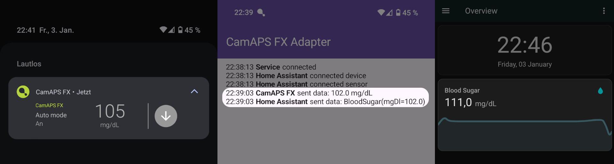

# CamAPS FX Adapter for Home Assistant

This app reads blood sugar values from CamAPS FX by observing its notifications and sends them to the HomeAssistant API.
This project serves as showcase for a blog post on
[writingbits.de](https://writingbits.de/2025/01/06/reading-android-notifications-with-custom-views-using-reflection.html).

### Third-party licenses

This software uses following technologies with great appreciation:

* [AndroidX](https://developer.android.com/jetpack/androidx)
* [Home Assistant](https://www.home-assistant.io/integrations/api)
* [Kotlin](https://kotlinlang.org)
* [Ktor](https://ktor.io)

### Disclaimer

This project is purely for scientific purposes and is not linked to CamDiab Ltd. or Open Home Foundation.
Its source code is presented as-is and will not be compiled, bundled and published, neither commercially nor non-commercially.
The author does not assume any liability for timeliness, correctness, completeness or quality of the provided source code.

### License

Copyright 2025 Philipp Fahlteich

Licensed under the Apache License, Version 2.0 (the "License");
you may not use this file except in compliance with the License.
You may obtain a copy of the License at

    http://www.apache.org/licenses/LICENSE-2.0

Unless required by applicable law or agreed to in writing, software
distributed under the License is distributed on an "AS IS" BASIS,
WITHOUT WARRANTIES OR CONDITIONS OF ANY KIND, either express or implied.
See the License for the specific language governing permissions and
limitations under the License.
